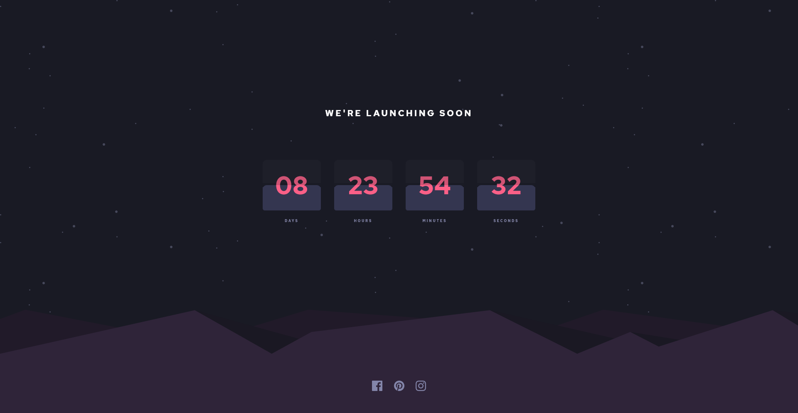

# Frontend Mentor - Launch countdown timer solution

This is a solution to the [Launch countdown timer challenge on Frontend Mentor](https://www.frontendmentor.io/challenges/launch-countdown-timer-N0XkGfyz-). Frontend Mentor challenges help you improve your coding skills by building realistic projects.

## Table of contents

- [Overview](#overview)
  - [The challenge](#the-challenge)
  - [Screenshot](#screenshot)
  - [Links](#links)
- [My process](#my-process)
  - [Built with](#built-with)
  - [What I learned](#what-i-learned)
  - [Useful resources](#useful-resources)
- [Author](#author)
- [Acknowledgments](#acknowledgments)

## Overview

### The challenge

Users should be able to:

- See hover states for all interactive elements on the page
- See a live countdown timer that ticks down every second (start the count at 14 days)
- **Bonus**: When a number changes, make the card flip from the middle

### Screenshot



### Links

- Solution URL: [Frontend mentor solution](https://www.frontendmentor.io/challenges/launch-countdown-timer-N0XkGfyz-/hub/responsive-counter-using-flex-Dy95o5RpaL)
- Live Site URL: [Live URL](https://countdown-fm.vercel.app/)

## My process

### Built with

- Semantic HTML5 markup
- CSS custom properties
- Flexbox
- Mobile-first workflow

### What I learned

I work with CSS custom properties and intervals from JS.

```css
:root {
  --grayish-blue: hsl(237, 18%, 59%);
  --soft-red: hsl(345, 95%, 68%);
}
```
And intervals with JavaScript
```js
let myInterval = setInterval(()  => ...)
```

### Useful resources

- [DOM manipulation](https://platzi.com/clases/dom/) - A useful resource for making changes within the DOM with JS

## Author

- Frontend Mentor - [@LeoCode0](https://www.frontendmentor.io/profile/LeoCode0)
- Twitter - [@LeoCode0](https://www.twitter.com/LeoCode0)

## Acknowledgments

I thank Toro for the moral support
